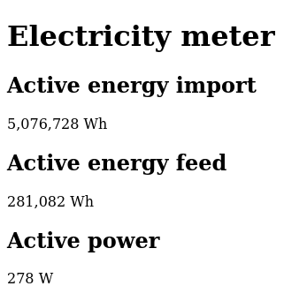

# Meter

A MicroPython-based web interface for electricty meters with IR SML interface.

## Screenshots



## Prerequisites

### Hardware

* Raspberry Pi Pico W
* Photodiode connected to GP1

### Software

* [Thonny IDE](https://thonny.org/) or similar for editing and
  uploading files to Raspberry Pi Pico

## Installation

### Prepare the Pi Pico

Install MicroPython by following the [official guides](https://www.raspberrypi.com/documentation/microcontrollers/micropython.html)
for you specific hardware.

### Copy Files to Pi Pico

Transfer the following files/folders to the root directory
(using Thonny IDE or similar):

* `config.py`
* `locale`
* `main.py`

Create a `lib` folder within the root directory and copy the following
libraries there:

* [microdot](https://github.com/miguelgrinberg/microdot):
  Copy the files `scr/microdot/__init__.py` and `src/microdot/microdot.py`
  into the `lib/microdot` directory.

### Configure settings

Open the file `config.py` and set your WIFI credentials and hostname.

```python
# Example
WIFI_SSID = "your ssid"
WIFI_PASSWORD = "your password"
HOSTNAME = "meter"
WIFI_COUNTRY = "it"
```

## Usage

Connect to the device using a web browser at `http://<hostname>`.
Replace `<hostname>` with the value set in `config.py`.

See `http://<hostname>/data` for JSON data.

Additional diagnostic information can be found at `http://<hostname>/raw-data`.
